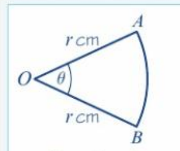
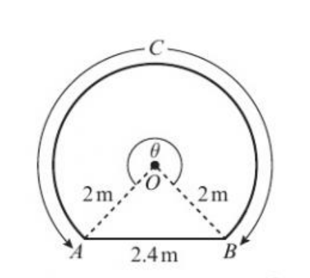
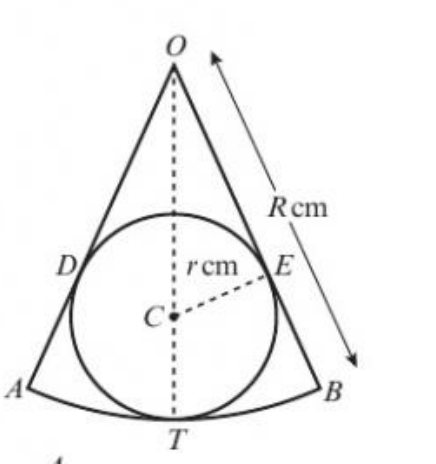
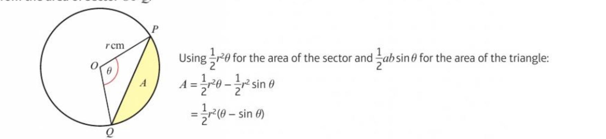

# Radian

Radian知识集包含了弧度制相关的知识

> 此知识集不属于解析几何，所以不应该使用参数方程等方式，请使用canvas非解析几何组件来绘制

## Usage 1 - 带有刻度的扇形绘制演示

1. 三个点(OAB)的显示
2. 弧度刻度标识
3. 角度边
4. 扇形边(弧)
5. 两边刻度

## Usage 2 - 弧度的花园问题

1. 优弧
2. 虚线的使用时机
3. 弧度刻度标识

## Usage 3 - 扇形内接圆

1. 角平分线
2. CE垂直于OB
3. 用这个图形印证他们的关系

## Usage 4 - 应用

